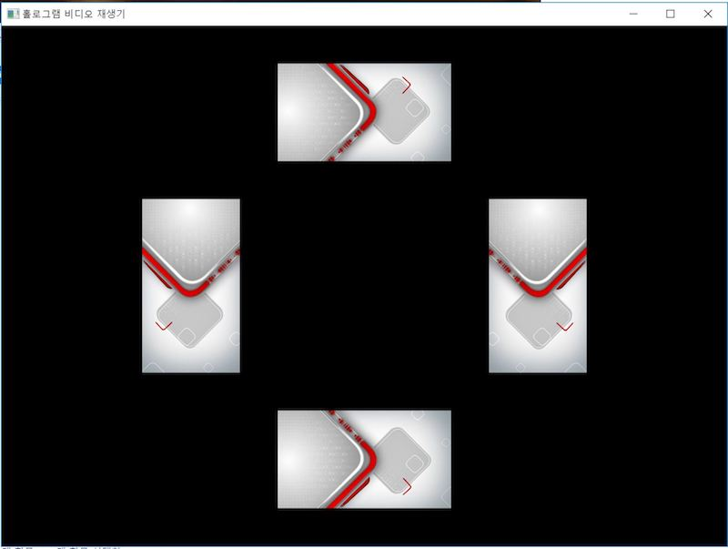

# Hologram Video Player


일반 비디오 영상을 홀로그램으로 볼 수 있도록 재생하는 재생기

**재생 방향**

1. 화면을 바닥에 두는 경우


2. 화면을 천장에 두는 경우


## Windows Player

- Visual Studio 2017 project
- 사용법
```
Enter : 전체화면 보기 (토글)
Space : 멈춤/재생 (토글)
M     : (Mute) 소리 켬/끔 (토글)
O     : (Open) 파일열기
1     : 화면을 바닥에 두는 방향으로 재생
2     : 화면을 천장에 두는 방향으로 재생
```

- 여러 영상의 싱크 맞추기

동일한 영상 4개가 아울러 재생되어야 하므로 하나의 영상을 기준으로 느리거나 빠르면 재생 속도를 조절하여 재생과정에서 지속적으로 싱크가 맞도록 처리하였다.<br/>
[두개의 미디어 동기화 방법](http://www.hoons.net/Board/net3tip/Content/36975)

```csharp
private void RunSync()
{
    MediaElement[] players = new MediaElement[] { player2, player3, player4 };
    players.ToObservable().Subscribe(p =>
    {
        double standard = player1.Position.TotalMilliseconds;
        double target = p.Position.TotalMilliseconds;
        double diff = standard - target;
        if (-2 < diff && diff < 2)
        {
            p.SpeedRatio = 1;
        }
        else
        {
            if (standard < target) p.SpeedRatio = 0.9;
            else p.SpeedRatio = 1.1;
        }
    });
}
```

- 스크린샷




## Android Player

- 비디오 회전시키기

VideoView 는 flip이나 회전이 적용이 안되기 때문에, TextureView 의 Surface에 비디오를 그리도록 하고 TextureView 를 회전시키도록 한다.

```java
public class FlippableVideoView extends TextureView implements TextureView.SurfaceTextureListener {

    private MediaPlayer mediaPlayer;

    private void init() {
        mediaPlayer = new MediaPlayer();
        setSurfaceTextureListener(this);
    }

    public void startVideo(Context context, Uri videoUri) {
        try {
            mediaPlayer.setDataSource(context, videoUri);
            mediaPlayer.prepare();
            mediaPlayer.start();
        } catch (Exception e) {
            e.printStackTrace();
        }
    }

    public void rotateRight() {
        this.setRotation(90.0f);
    }

    public void rotateLeft() {
        this.setRotation(-90.0f);
    }

    public void flipH() {
        this.setScaleX(-1 * this.getScaleX());
    }

    public void flipV() {
        this.setScaleY(-1 * this.getScaleY());
    }


    /****
     * Implements of SurfaceTextureListener
     */

    @Override
    public void onSurfaceTextureAvailable(SurfaceTexture surfaceTexture, int i, int i1) {
        mediaPlayer.setSurface(new Surface(surfaceTexture));
    }
}
```

## iPhone Player

TO-DO

## 참고

* [DIY 3D Hologram Pyramid Using Your SmartPhone!](https://diyhacking.com/diy-hologram/)
* [DIY Hologram](http://imadeforyou.blogspot.kr/2015/10/diy-hologram.html)